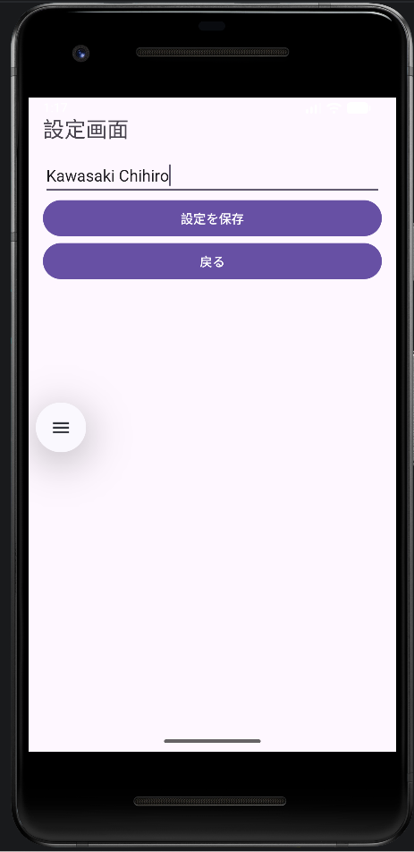
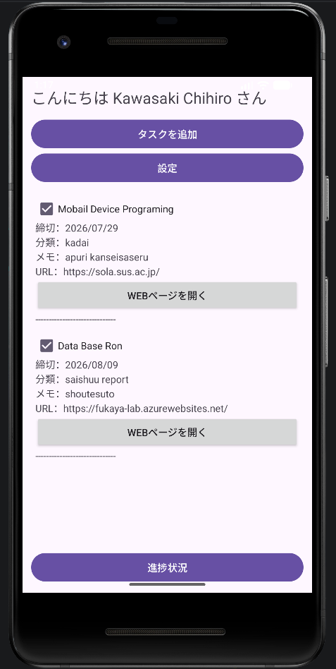
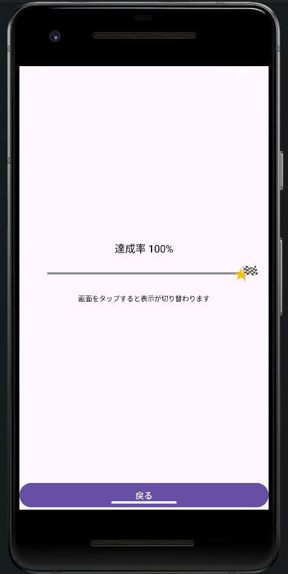
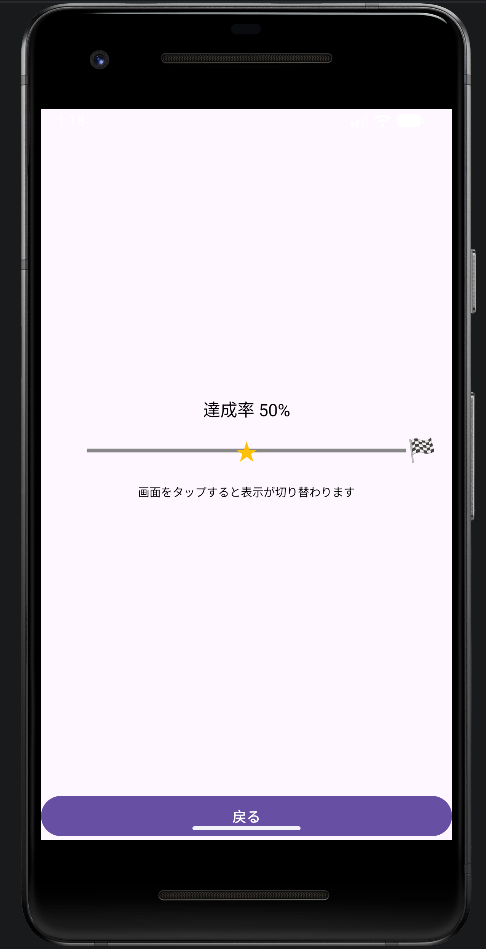

# ToDo App

## 概要
Android Studioで開発したタスク管理アプリです。
タスクの追加・編集・削除ができ、日々の予定ややることを簡単に管理できます。

## スクリーンショット

## 機能
- タスクの追加
- タスクの編集
- タスクの削除
- タスク一覧の表示
- 完了・未完了の管理（実装している場合）

## 使用技術
- Kotlin
- Android Studio

## 工夫した点
- シンプルで見やすい画面デザインを意識しました。
- タスクの追加・編集・削除を直感的に操作できるようにしました。
- ユーザーが使いやすいレイアウトになるよう工夫しました。

## 今後の改善点
- タスクの検索機能
- 締切日の設定
- 通知機能
- カテゴリごとの管理
